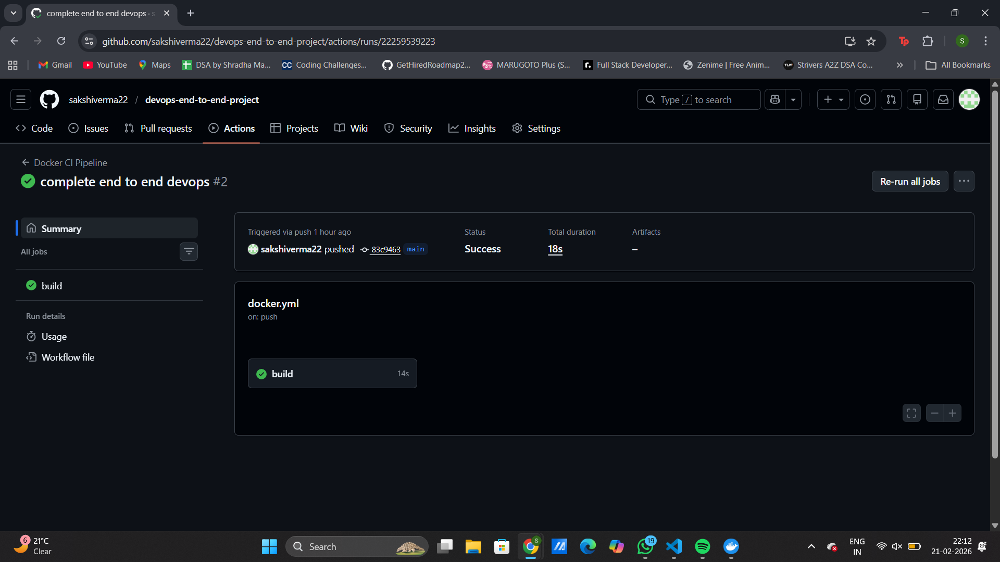
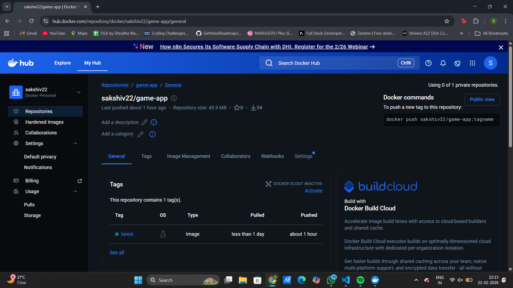
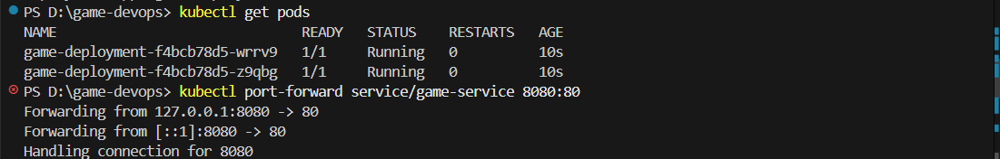
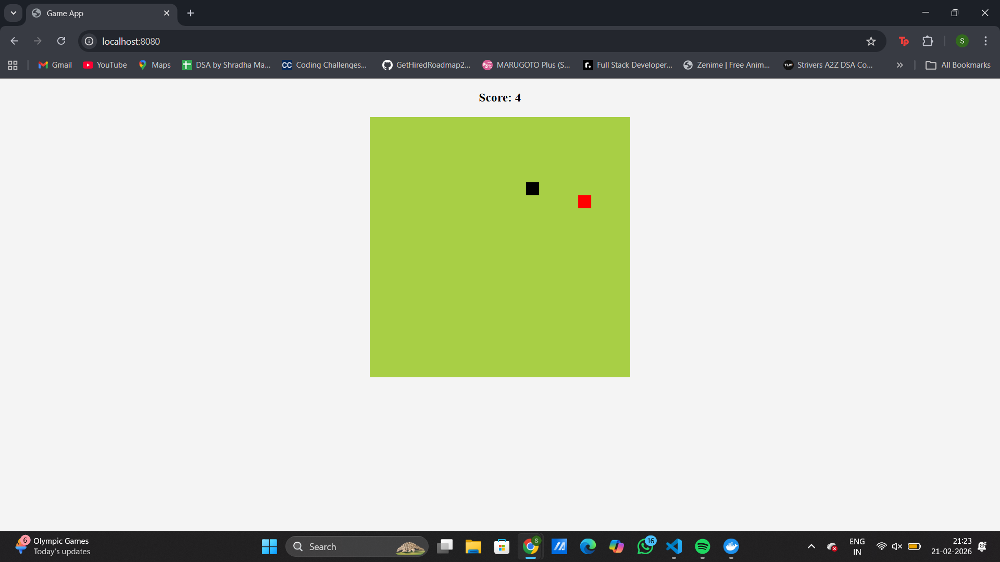

# End-to-End DevOps CI/CD Pipeline – Game Application

## Project Overview
This project demonstrates a complete DevOps pipeline from source code commit to Kubernetes deployment.

A browser-based game application is:
- Containerized using Docker
- Built and pushed automatically via GitHub Actions
- Stored in Docker Hub
- Deployed on Kubernetes (Docker Desktop Kubernetes)
- Exposed via Kubernetes Service

---

## Architecture

GitHub → GitHub Actions → Docker Hub → Kubernetes → Live Application


---

## Tech Stack

- HTML, CSS, JavaScript
- Docker
- GitHub Actions
- Docker Hub
- Kubernetes
- kubectl

---

## CI/CD Workflow

1. Developer pushes code to GitHub
2. GitHub Actions builds Docker image
3. Image pushed to Docker Hub
4. Kubernetes pulls latest image
5. Deployment updates automatically

### GitHub Actions Pipeline



### Docker Hub Image



---

## Kubernetes Resources

- Deployment (2 replicas)
- NodePort Service
- Rolling updates supported

### Running Pods



---

## Application Output

Application exposed using Kubernetes port-forwarding:

```
kubectl port-forward service/game-service 8080:80
```

Access at:
```
http://localhost:8080
```

### Live Application Screenshot



---

## Key DevOps Concepts Implemented

- Containerization
- CI pipeline automation
- Container registry integration
- Kubernetes orchestration
- Rolling updates
- Service exposure
- Debugging ImagePullBackOff issues

---

## How to Run Locally

```bash
docker build -t game-app .
docker run -p 8080:80 game-app
```

---
